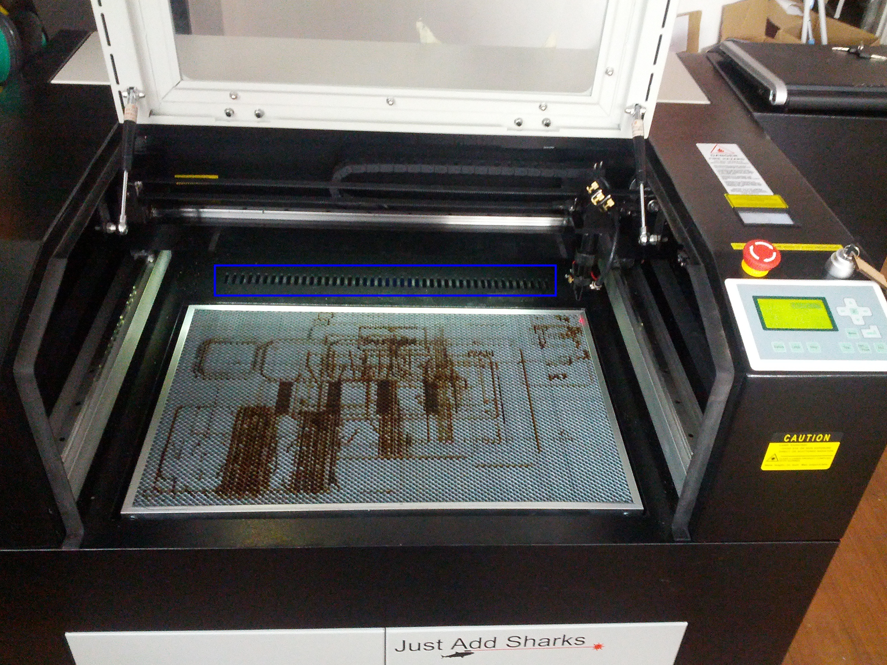
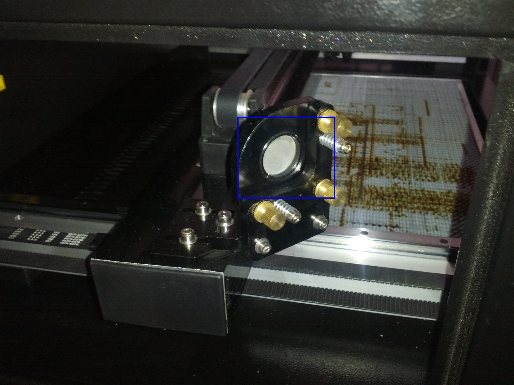
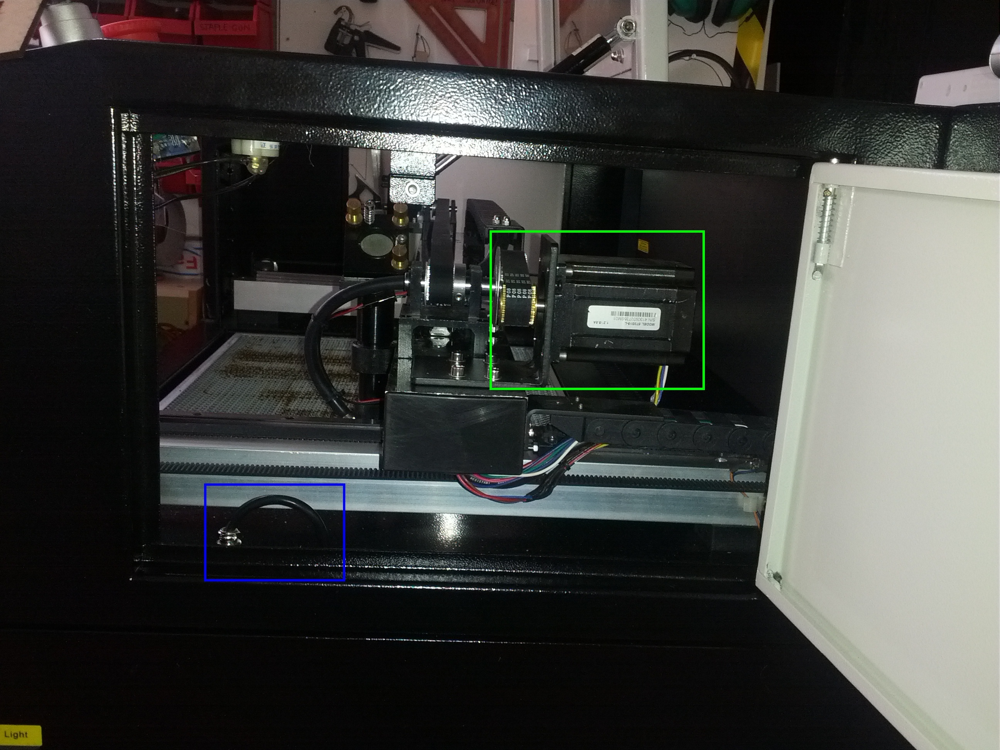
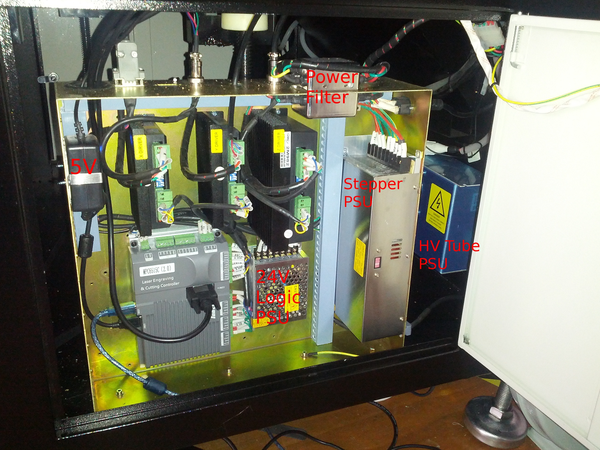
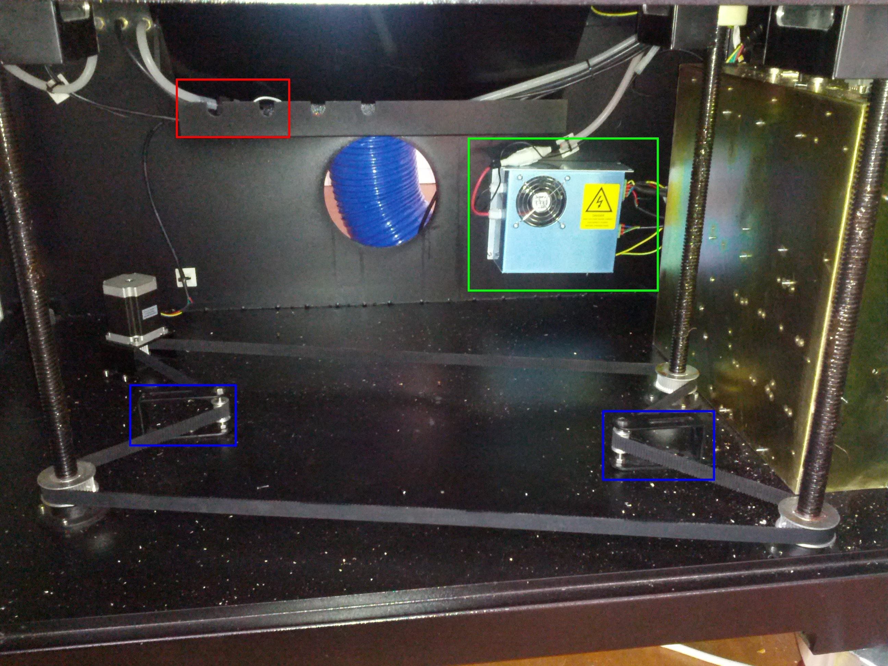
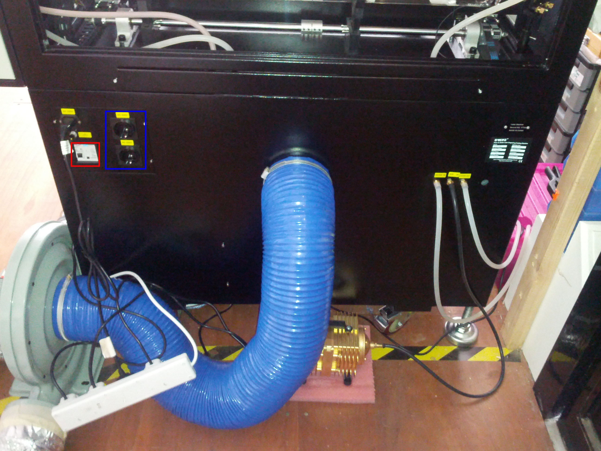
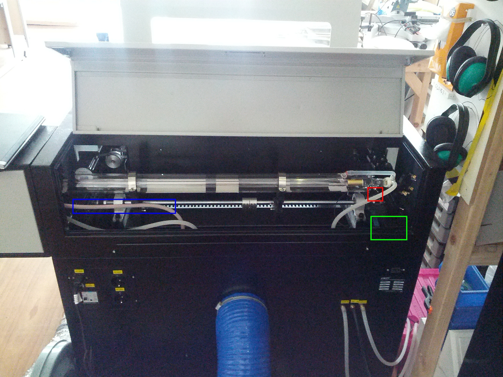
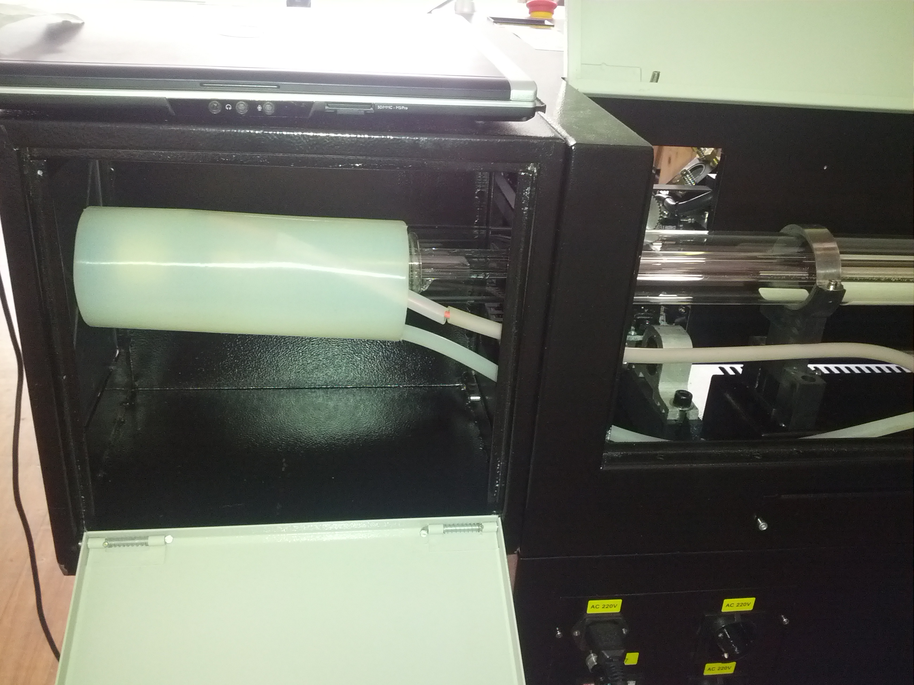
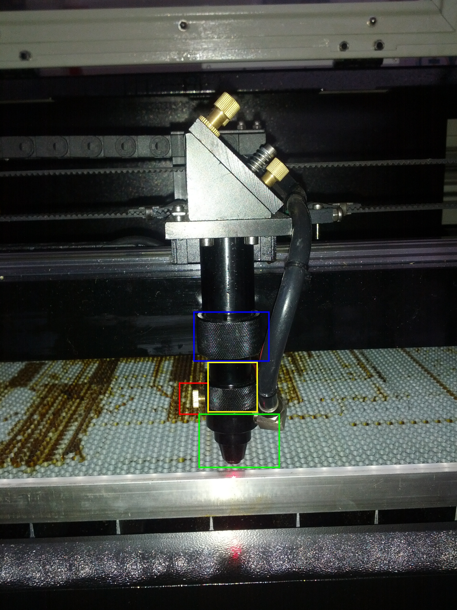

Laser Cutter Components
-----------------------

It is best to familiarise yourself with the components in the laser cutter, this will aid future troubleshooting/hacking.

  1.  Open the front cover of the machine, notice the following:

    -  The X/Y gantry moving the lens head, including drive belts and runners
    -  The beam path from the lens head to the left of the gantry then to the rear left of the machine
    -  The main fume extraction vent behind the bed (highlighted in blue)
    -  The optionally removable sections on the front guard and rear of the machine, enabling a longer section of material to be machined
  2.  Open the upper left side panel:

    -  Gantry mirror (highlighted in blue)
    -  The adjustment screws on the gantry mirror
  3.  Open the upper right side panel:

    -  Access to the X axis motor and pulley (highlighted in greed)
    -  The Y axis motor cable (highlighted in blue), this could be used for a rotary attachment
    -  Access to the front panel electronics
  4.  Open the lower right side panel:

    -  Within the metal box:
      -  On the left is the 48V power supply for the stepper motors
      -  In the bottom centre is the 24V power supply for the control logic
      -  On the bottom right is the laser control board
        -  USB1 connects to the laptop
        -  USB2 connects to the side USB port
        -  Black D-Sub connector connects to the front panel?
      -  On the top from left to right:
        -  5V power supply for the red laser
        -  X axis stepper driver
        -  Y axis stepper driver
        -  Z axis stepper driver
    -  On top of the box from left to right is:
        -  A DSUB connection for all 3 limit switches
        -  A round connector for the X axis motor
        -  A round connector for the Z axis motor
        -  A mains power filter
    -  On the right of the box from top to bottom is:
        -  A very unsafe IEC connector
        -  A DSUB connection for the control data to the HV PSU
    -  Above the metal box is a rats nest of cabling cable tied together into one incomprehensible mess carrying a mixture of 5V power and logic, 24V logic, the stepper driver outputs, 240V mains and the HV cathode
    -  Behind the box to the left is the high voltage supply for the laser tube
  5.  Open the front double doors:

    -  The HV PSU (highlighted in greed)
    -  The metal box described above
    -  The Z axis stepper motor, drive belt and tensioners (tensioners highlighted in blue)
    -  The three Z axis screws
    -  The water cooling flow sensor (highlighted in red)
  6.  On the back panel:

    -  The main power inlet and breaker (breaker highlighted in red)
    -  The two always on power outlets (highlighted in blue)
    -  The water cooling in and out ports
    -  The air pump in port
    -  The fume exhaust port
    -  The air in vent (below fume exhaust port)
  7.  Open the rear tube cover:

    -  The tube
    -  The small black cathode clip at the right of the tube (highlighted in red)
    -  The large red anode cable at the left of the tube (highlighted in blue)
    -  The water cooling flow pipe at the left of the tube
    -  The water cooling return pipe at the right of the tube
    -  The tube alignment adjustments on the tube mountings
    -  The Y axis motor (highlighted in green)
  8.  The lens head on the gantry:

    -  The conical air flow and red laser fitting (highlighted in green)
    -  The screw used to remove that fitting (highlighted in red)
    -  The lens body (highlighted in yellow)
    -  The screw to remove the lens (hlighlighted in blue)
