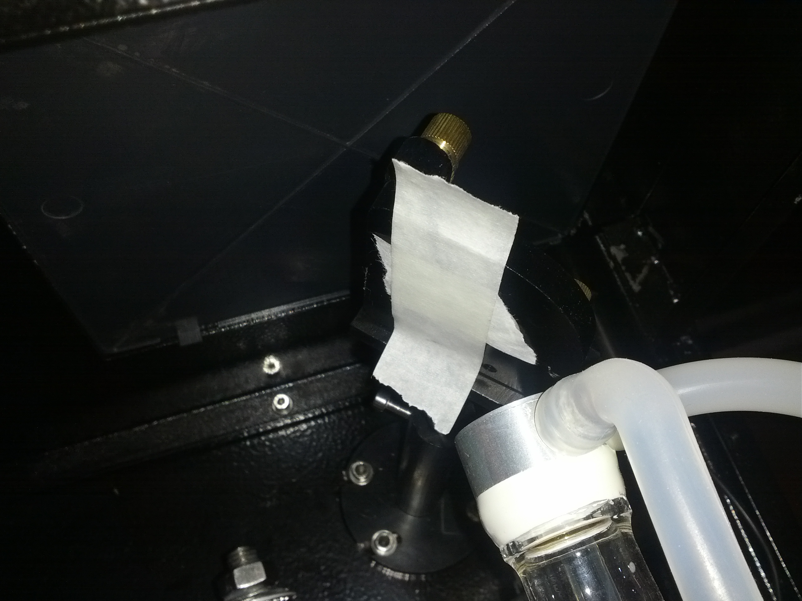
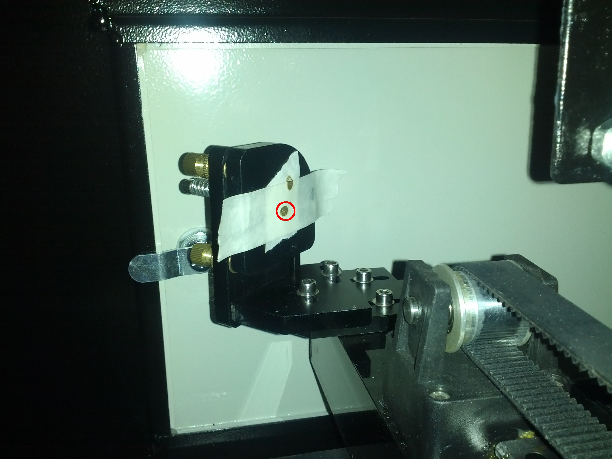
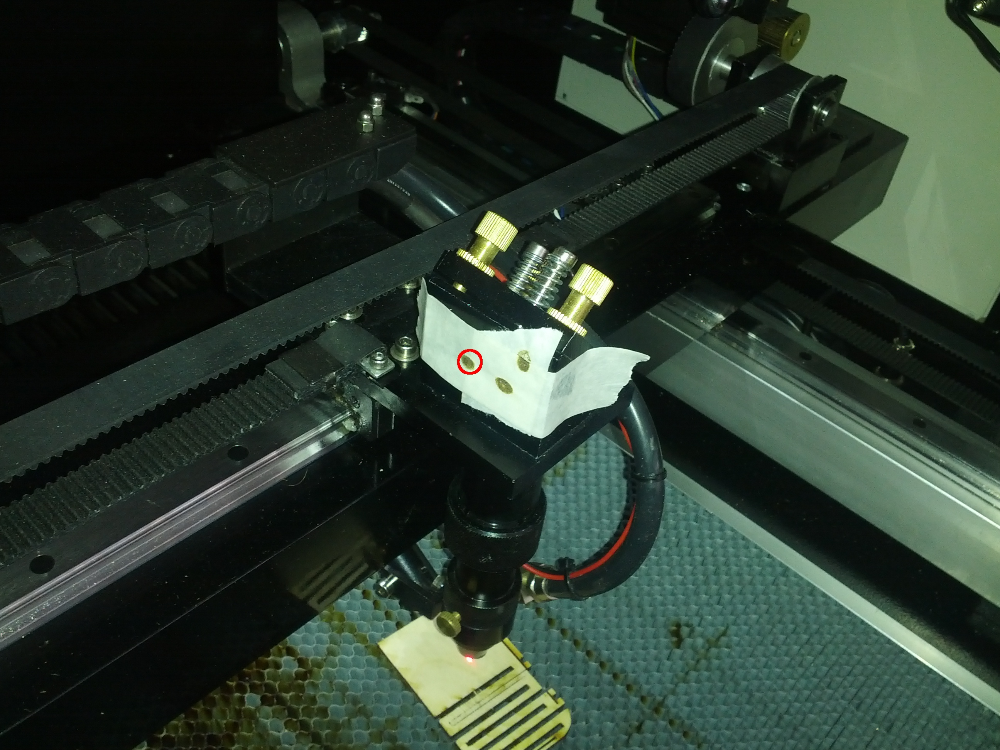
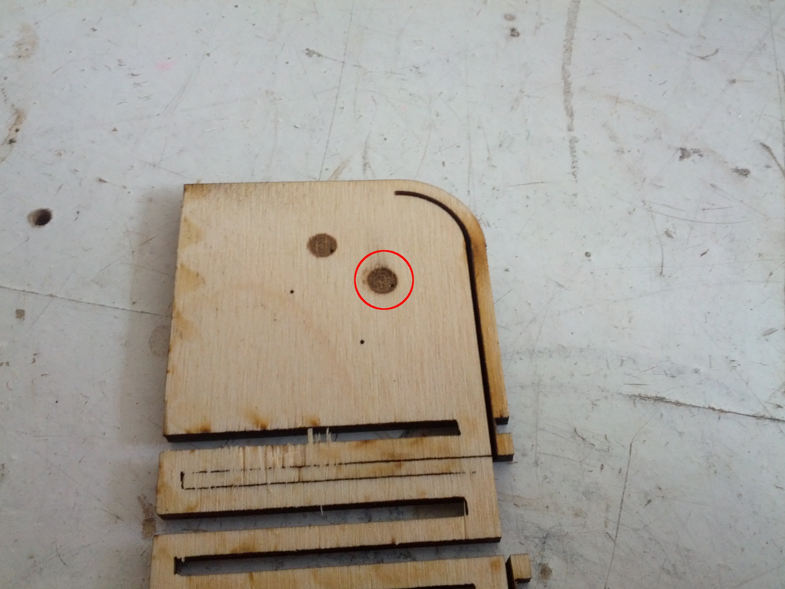
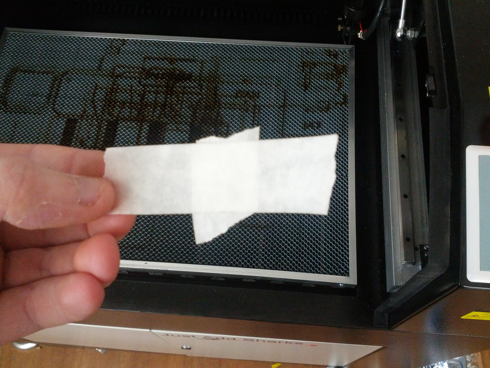
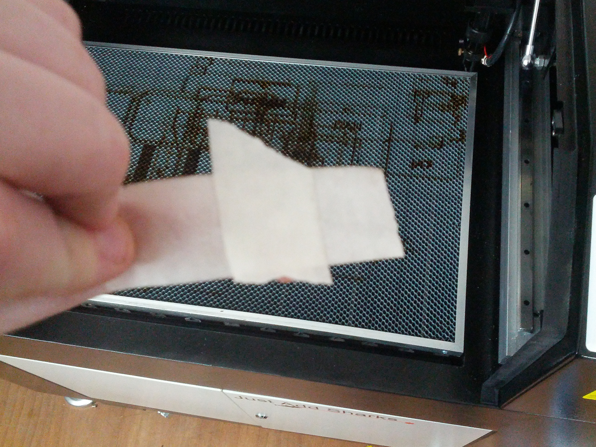

CO2 Laser Alignment
===================

This guide explains the procedure for aligning the CO2 laser and optics to ensure a level beam.

Note that this guide is dangerous as it exposes the laser tube and optics whilst the tube is powered.

This guide assumes the machine is fully powered off and that both the honeycomb and knife beds are present.

Laser Alignment
---------------

  1.  Power on the laser cutter and water pump
  2.  Open the rear tube cover
  3.  Place two layers of masking tape on the rear mirror (in the right hand side of the tube compartment) such that no adhesive is touching the mirror (see "Tube" below)
  4.  Close the rear cover and fire the laser (by pressing the "Laser" button with the front guard closed)
  5.  Check the location of the scorch mark on the tape and correct it by moving the laser tube using the four adjustment screws on the tube mounts, repeat step 4 until scorch mark is in centre of tape (may need to replace the tape several times)
  6.  Move the Y axis forward to the centre of the bed
  7.  Open the left side panel (looking from front of machine) and apply tape to side mirror (see "Tube Mirror" below)
  8.  Fire laser, check position of scorch and use adjustment screws on rear mirror to correct position of scorch, repeat step 7 until scorch mark is in centre of tape
  9.  Close and lock rear tube cover
  10.  Follow same procedure with mirror aperture on top of lens head (see "Y Axis Mirror" below)
  11.  Place a section of material on the bed, focus the laser and fire the CO2 laser (see "X Axis Mirror" below)
  12.  Correct it's position using the adjustment screws on the top mirror
  13.  Run through the Red Laser Alignment process
  14.  Power off the laser cutter and water pump

Tube
----

Here the object being moved is the tube, using masking tape on the tube mirror.

Tube Mirror
-----------

Here the object being moved is the tube mirror, using masking tape on the Y axis mirror.

Y Axis Mirror
-------------

Here the  object being moved is the Y axis mirror, using tape on the X axis mirror.

X Axis Mirror
-------------

Here the object being moved is the X axis mirror, using a piece of material on the bed.

Note in the image how the small in focus dot is not in the centre of the large out of focus circle, this shows that the alignment is not correct. The smaller in focus dot should be roughly in the centre of the large out of focus circle.

Masking tape for mirrors
------------------------

It is important to keep the tape off the mirrors in order to keep them clean, this can be done by using two sections of masking tape to prevent any adhesive touching the mirrors

